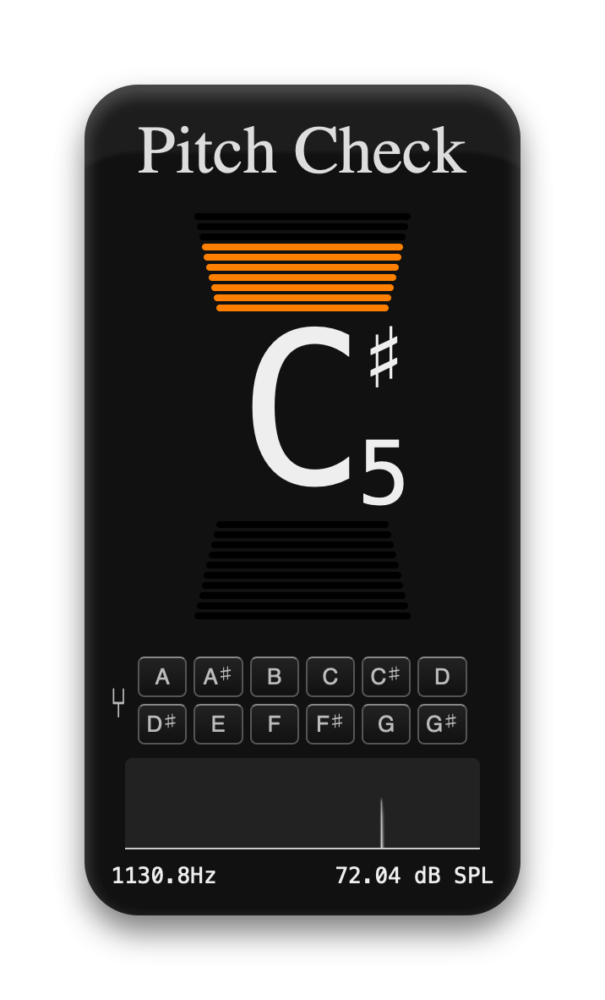

# Pitch Check

A simple tool to show the current note being picked up by the microphone. Can be used
for tuning stringed instruments.

Displays a raw frequency graph, the peak frequency, decibel level, equivalent note,
and the difference from the ideal note (in 10 cent intervals).

Extracted frequency is accurate to &plusmn;0.05Hz at lowest supported pitch
(A1), and more accurate at higher pitches. Tested with ideal sine waves.

Uses the baseline A4 = 440Hz
